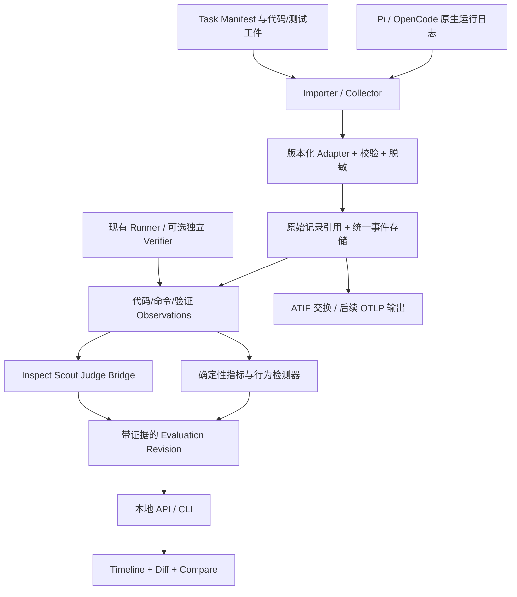

# Coding Agent 性能评估系统：调研与实施计划

日期：2026-09-12。状态：设计提案，尚未实施。

依据：用户提供的 Project Handoff，以及下文链接的上游仓库、协议和官方文档。当前项目目录为空。本次核查了公开文档和部分类型源码，没有安装、运行或验证这些竞品的端到端能力；表中的“支持”表示公开材料已说明，“未确认”不等于不存在。实施时需要固定上游版本和提交号，并用真实日志再次验证。

## 1. 执行判断

**建议：MODIFY IDEA。保留结果与过程共同评估的方向，收窄为本地 Coding Agent 运行诊断与回归比较工具。**

“解释 agent 为什么失败”已经不是空白市场。AgentLens 已覆盖确定性验证、带证据的轨迹评审和成对比较；Inspect Scout 已提供 transcript 扫描、引用和查看器。重复做一套通用 trace dashboard 或 LLM 打分系统，很难形成独立价值。[AgentLens](https://github.com/agent-lens/agent-lens-bench)、[Inspect Scout](https://meridianlabs-ai.github.io/inspect_scout/)

值得验证的切口是：**直接导入 Pi / OpenCode 的真实开发日志，把行为证据与具体代码版本、测试结果关联，并明确告诉用户哪些结论无法从日志判断。**

第一批用户选择维护 coding-agent harness、skills、提示词和工具配置的开发者，以及在内部代码库试用不同 agent 的小团队。他们需要回答：“这次配置修改让 agent 更好了还是更差了？失败集中在哪些行为？下一步改什么？”

替代的痛苦流程是：手工翻 JSONL → 查命令输出 → 对照 Git diff → 手动复跑测试 → 凭印象写对比报告。

首个产品承诺：用户导入同一任务的两个运行包后，几分钟内获得可点击验证的差异报告。报告能区分任务失败、环境失败和数据缺失，而不是只输出总分。

### 需要修正的假设

| handoff 中的直觉 | 设计修正 |
| --- | --- |
| 读文件少意味着探索更好 | 工具粒度、任务规模、缓存和工具返回内容都会影响数量；默认作为描述指标 |
| 反复编辑意味着无效循环 | 正常迭代也会反复编辑；必须结合文件版本、失败签名和验证进展 |
| 没有 test_run 就是没有验证 | 可能经 shell、脚本或子 agent 验证，也可能日志丢失；先检查可观测性 |
| 看了正确文件就完成了定位 | 文件内容出现在工具结果不代表模型理解；只报告可观察代理指标 |
| 有最终 diff 就能完整 replay | 只能展示最终差异；逐步代码回看需要当时的快照或补丁 |
| 测试全通过就完成任务 | 还要验证任务专用验收条件、测试完整性和既有行为是否回归 |
| 单次运行就能比较 agent 性能 | 单次比较适合个案诊断；稳定性能结论需要多任务、多次重复 |
| Claude / GPT / Pi 是同级对象 | 要分开 agent/harness、provider、model 和配置；比较单位是完整 setup |
| 轨迹能直接证明根因 | 多数只能给出证据支持的失败假设；因果结论还需对照重跑或干预 |

## 2. 竞争格局与复用决策

为避免过宽的表格，将 handoff 要求的字段分为两张矩阵。轨迹回看表示查看记录；状态重放表示从历史环境恢复执行，两者分开。

### 功能矩阵

| 项目 / 目的 | agent 范围 | trace / 数据格式 | 确定性评估 | LLM 评估 | 轨迹分析 / 可观测性 | 比较 |
| --- | --- | --- | --- | --- | --- | --- |
| [OpenChamber](https://github.com/openchamber/openchamber)：开发工作区 | 基于 OpenCode，多模型 | OpenCode session/API | 开发过程中的命令与状态；专用基准评分未确认 | Session Goals、变更讲解 | 会话、工具、Git、成本状态 | 已有 Multi-run |
| [AgentEval](https://github.com/rexblade58/agenteval)：coding agent 同题验证 | Codex、Claude、OpenCode、Gemini、Aider、通用 command | 运行结果 JSON、报告；未确认统一完整事件协议 | tests/build/lint/typecheck、baseline regression | Arena 以实际验证为主；另有模型评估流程 | 日志、时间、成本；细粒度诊断需核查 | 同任务 Arena |
| [AgentLens](https://github.com/agent-lens/agent-lens-bench)：轨迹评审 | IDE engine、Claude Code 等 REST adapter | IDE runner dumps | 测试、仓库状态、构建、静态检查 | 带证据的单次和成对评审 | 完整交互与工具、diff、遥测 | 同任务、anchor、回归 |
| [SWE-agent](https://github.com/SWE-agent/SWE-agent)：自动修复与研究 harness | 自身 agent，可换模型 | JSON `.traj`、history | SWE-bench 等外部验证 | 通用轨迹 judge 非核心 | action/observation 轨迹 | 借助 benchmark 聚合 |
| [SWE-Explore](https://github.com/Qiushao-E/SWE-Explore-Bench)：探索与定位 benchmark | Claude Code、Cursor、Mini-SWE-Agent 等 explorer | 排名文件/行区间、探索结果 | 与参考区域比较 | 参考区域提炼等阶段使用模型 | 编辑前的探索质量 | explorer 指标比较 |
| [Inspect AI](https://github.com/UKGovernmentBEIS/inspect_ai)：通用评估框架 | 自定义 solver/agent，多 provider | EvalLog / `.eval`，支持结构化事件 | 可扩展 scorer | model-graded scorer | transcript、tool 与评估日志 | 评估集及日志比较 |
| [Langfuse](https://github.com/langfuse/langfuse)：通用 LLM 观测评估 | SDK/OTel 接入的应用 | OTel + 产品 observation/score | 自定义评分与实验 | LLM judge | trace、用量、成本、数据集 | experiments |
| [SAP Agent Quality Inspect](https://github.com/SAP/agent-quality-inspect)：TED 子目标评估 | 已有 Tau2Bench、ToolSandbox runner，可扩展 | AgentDialogueTrace / EvaluationSample | 聚合计算；子目标成立主要由 judge 判定 | 逐轮子目标判断、错误分类 | 进展曲线和错误分析 | AUC、PPT、可靠性统计 |
| [Agent Trajectories](https://github.com/tbtommyb/agent-trajectories)：恢复干预研究 | 研究计划聚焦开放权重 coding agent | 计划中的逐步轨迹、快照、激活 | 计划使用 SWE-bench oracle | 计划中的步骤标注/监测 | 研究设计；不当作成熟工具 | 恢复/干扰的对照实验计划 |
| [Harbor](https://github.com/harbor-framework/harbor)：执行评估 harness | Claude Code、Codex CLI、OpenHands 等 | ATIF + trial/task artifacts | 容器内任务 verifier | 可扩展；非本方案默认 judge | 运行轨迹和实验工件 | benchmark / trial 聚合 |
| [Inspect Scout](https://meridianlabs-ai.github.io/inspect_scout/)：离线轨迹扫描 | 导入 transcript，按格式扩展 | Transcript、messages/events、扫描结果 | grep / custom scanner | LLM scanner，结构化结果与引用 | 批量扫描、证据查看器 | 扫描结果分析；coding 同题 diff 对比需补充 |

### 工程、界面与限制矩阵

| 项目 | 架构 | UI / 回看 / 重放 | 许可证 | 对本项目的限制或复用方式 |
| --- | --- | --- | --- | --- |
| OpenChamber | OpenCode API + 多端工作区 | 会话、diff、review；历史状态重执行未确认 | MIT | 参考交互和集成方式；不 fork 整个工作区 |
| AgentEval | Python core、CLI、verifiers、报告 | JSON/Markdown/HTML；另有 dashboard | MIT | 可复用 runner 输出和验收结构；README 状态表与 roadmap 部分不一致，需实测 |
| AgentLens | Python evaluator + Kotlin/JetBrains runner | Markdown 报告、静态 leaderboard；通用交互 replay 未确认 | Apache-2.0 | 最接近的竞争基线；先测试可否适配外部 dump，避免重写其已解决的问题 |
| SWE-agent | Python agent + 执行环境 | trajectory inspector；不是通用本地日志工作台 | MIT | 复用轨迹输入和 benchmark 结果；不重写 SWE-bench harness |
| SWE-Explore | Python explorer/evaluation pipeline | 数据和评估输出；通用 review UI 未确认 | MIT | 参考探索指标与数据集，不能把参考文件当唯一正确路径 |
| Inspect AI | Python 评估引擎 + Web viewer | 日志、评分、对话与工具查看 | MIT | 可作为受控实验和 scorer 后端 |
| Langfuse | Web/worker + 分析存储服务 | 成熟 trace/experiment UI | MIT，`ee` 目录另有条款 | 后续 OTLP 输出目的地；本地 MVP 不强制部署其服务栈 |
| SAP Agent Quality Inspect | Python metrics/runners + leaderboard demo | 进展与错误统计，通用代码状态重放未确认 | Apache-2.0 | 参考显式子目标和错误分析；其 Python import 名已是 `agent_inspect` |
| Agent Trajectories | 目前以研究说明和实验工件为主 | replayable benchmark 是计划目标 | 本次公开页面未确认许可证 | 关注恢复实验方法，暂不作为运行时依赖 |
| Harbor | Python + 容器环境 providers | 运行工件；具体 viewer 版本需核查 | Apache-2.0 | 批量受控执行优先接它，不自己开发远程调度 |
| Inspect Scout | Python scanner + Web viewer | 扫描结果及引用回看 | MIT | 首选复用 transcript/scanner/judge；补充 coding 语义和代码版本关联 |

许可证按公开 LICENSE/仓库说明列示，其中 [Harbor LICENSE](https://github.com/harbor-framework/harbor/blob/main/LICENSE)、[Scout LICENSE](https://github.com/meridianlabs-ai/inspect_scout/blob/main/LICENSE)、[SWE-agent LICENSE](https://github.com/SWE-agent/SWE-agent/blob/main/LICENSE)已单独核查。上游组件和数据集的许可需要在实际引入时逐项记录。

**已经解决得较好的部分**：通用遥测、模型评估调用、日志查看器、容器 benchmark 执行、单次轨迹 LLM 评审。**需要构建并验证的部分**：低侵入 CLI 日志接入、可观测性契约、代码版本与行为的证据关联、低误报 detector、对等实验条件检查，以及面向配置回归的双运行体验。

## 3. MVP 边界与产品体验

### v0.1 必须实现

1. 导入 Pi session JSONL 与 OpenCode session export JSON，各固定一个经过验证的版本范围。
2. 导入 Task Manifest、base/final patch 和 JUnit 或结构化 verifier 结果；这些工件可以由现有 runner 生成。
3. 建立版本化、可追溯的统一事件和 observation；显示缺失、脱敏、截断情况。
4. 一个运行详情页：时间线、工具输入输出、文件/最终 diff、验证结果、诊断证据联动。
5. 五个首批行为检测器：重复只读调用、重复失败循环、最终变更未验证、明确约束违反、验证后恢复。
6. 可选轨迹 judge，补充意图符合程度、改动必要性和恢复解释；不用 judge 也能完成核心流程。
7. 两个运行的比较页：可比性、结果、成本/时长、主要行为差异与对应证据。
8. 导出 Markdown/JSON 报告和可移植运行包；不依赖账号或云服务。

前端只做运行列表、运行详情、运行比较三个页面。点击 finding 后定位事件与对应 artifact；最终 diff 与“当时的 diff”需要明显区分。

### 接在 v0.1 后的 v0.2

可选的本地记录器：Pi JSON/RPC 或只观察的 extension；OpenCode SSE + 结束时导出。保存开始/结束仓库状态，条件允许时保存关键编辑快照。增加本地容器独立验证入口，以及 Claude Code / Codex adapter。

### 暂不做

多 agent 编排、自动 continue/stop 决策、远程执行集群、IDE、组织权限与计费、公开排行榜、全局 0–100 总分、全库语义索引、向量数据库、从任意历史步骤恢复执行。

**关键边界**：日志导入不会执行日志里的 shell 命令。v0.1 的 timeline replay 是查看已记录的历史，不承诺重建缺失的文件内容或恢复模型内部状态。

## 4. 系统架构与技术栈



部署形态是单机模块化应用：一个 Python 服务提供 API 和打包的前端静态资源，后台用本机 worker 处理大文件和评估。依赖边界用函数、数据模型和插件接口表达，不拆微服务。

| 层 | 推荐技术 / 职责 | 理由 |
| --- | --- | --- |
| Core / CLI | Python、Typer、Pydantic | 与 Inspect / Scout / Harbor 生态连接，减少跨语言评估逻辑 |
| Schema | Pydantic 作为权威定义，生成 JSON Schema/OpenAPI/TS types | 避免 Python、前端、adapter 各维护一套不一致定义 |
| API | FastAPI；普通 HTTP，任务进度可用 SSE | 本机运行与未来 CI 都容易接入 |
| 存储 | SQLite WAL + 本地 content-addressed artifacts | 无数据库服务依赖；不引入 Redis、Kafka、ClickHouse |
| 评估 | 自定义确定性 detectors + Inspect Scout bridge | 复用 scanner、模型 provider、结构化结果与引用能力 |
| 受控执行 | v0.1 导入外部结果；后续接 Harbor/现有 CI | 执行环境属于另一个复杂子系统 |
| UI | React + TypeScript + Vite、虚拟化列表、现成 diff viewer | 聚焦证据浏览，避免自行开发编辑器 |
| 工具链 | uv、pytest；pnpm、TypeScript、Playwright | 后端重数据契约；前端验证少量关键交互 |

Pi/OpenCode 的第一版导入器直接解析文件，不要求运行它们的 TypeScript SDK。后续如果某个官方 SDK 明显降低兼容成本，再增加一个小型 TS collector subprocess。

### 复用决策门槛

第一周用相同的少量脱敏日志验证三条路径：Scout 扩展、AgentLens dump 适配、小型独立 analyzer。默认选择 Scout 作为可选 judge/scanner 后端，业务数据仍归本项目 schema 管理。

如果 Scout 加上两个 importer 就已经足够满足用户的诊断需求，项目应以插件/扩展交付，延后独立 Web UI。只有 code-state 联动、可观测性声明和成对比较确实补上缺口时，才投入独立界面。

Scout 已公开 custom scanner、结构化结果和 message references；是否完整保留 coding-specific artifacts，需要通过适配实验确认，不假设原生已经支持。[Scout scanner 与 viewer 文档](https://meridianlabs-ai.github.io/inspect_scout/)

### 存储设计

逻辑表：`tasks`、`setups`、`sessions`、`runs`、`source_records`、`events`、`observations`、`artifacts`、`evaluation_revisions`、`metrics`、`findings`、`evidence_refs`、`comparisons`、`jobs`。

原始与规范化事件追加写入；重算生成新的 normalization/evaluation revision，保留旧结果。SQLite 的查询投影可以重建。大段输出、源码和 diff 存 artifact，数据库只存 metadata、hash 和引用。

导入时按 source identity + record locator + normalization version 做幂等键。未知事件保留并计入 coverage，不能静默丢弃。截断的尾行先标记 incomplete，不能把它当作有效结束。v0.2 SSE 断流后拉取最终会话数据补齐，再按稳定的 message/part/call ID 去重，不能把每次更新都算作新调用。

默认本地存储。原始敏感文件留在源位置，运行包保存可追溯的脱敏副本；明确选择保留原文时才进入受保护本地 artifact。脱敏规则也要版本化，不能脱敏后宣称还能逐字验证原始内容。

### API 草案

```text
POST /imports                       导入本地运行包，返回 job_id
GET  /jobs/{id}                      导入/评估任务状态与错误
GET  /runs/{id}                      setup、task、coverage、状态
GET  /runs/{id}/events?cursor=...     分页时间线
GET  /artifacts/{id}                 受限的 artifact 读取
POST /runs/{id}/evaluations          指定 profile / judge 配置生成新 revision
GET  /evaluations/{id}               metrics、findings、evidence
POST /comparisons                    固定两个 evaluation revision 进行比较
GET  /comparisons/{id}               可比性声明与差异
```

API 只绑定 localhost；artifact 用内部 ID 解析，禁止任意本地路径读取。judge 和代码执行都在显式功能入口中开启，不由导入文件的内容触发。

## 5. 统一 Trace：标准与数据模型

### 标准选择

**采用 OTel 的关联与遥测语义，采用 ATIF 做轨迹交换，保留一层小型 coding-domain 数据模型。**

OpenTelemetry 的 trace/span/context 可以表达层级与耗时，但不是测试结果、代码快照和诊断证据的完整数据库。GenAI agent semantic conventions 当前仍标为 Development，因此映射要锁定版本。[OTel GenAI agent conventions](https://github.com/open-telemetry/semantic-conventions-genai/blob/main/docs/gen-ai/gen-ai-agent-spans.md)

Harbor 的 ATIF 已描述消息、工具调用、observation、metrics 和子轨迹，本次页面显示 v1.8；其 reasoning 字段是可选的。建议导入/导出固定版本 ATIF，并把 coding artifacts、coverage、evidence 等放在命名空间扩展或伴随文件中。ATIF 的 session 含义不直接等于本项目持久会话 ID，需要显式映射。[ATIF RFC](https://github.com/harbor-framework/harbor/blob/main/rfcs/0001-trajectory-format.md)

内部可以用 append-only JSONL 的 event envelope 支持流式增量；对外输出 ATIF 文档。不是要求 agent 改成我们的协议，也不声称 ATIF/OTLP 往返转换能无损保存所有 native 字段：每个导出生成 loss report，未映射信息仍留在运行包。

### 身份与边界

- `Task`：版本化任务与验收条件；不仅是 prompt 字符串。
- `Setup`：agent/harness + version + provider/model + reasoning setting + tools/skills/prompt/config hashes。
- `Session`：原生持久对话容器，可能包含多个任务、分支和恢复。
- `Run`：同一 Task/Setup 下的一次被评估尝试，可跨多个 turn；重评 run 不会新增一次执行。
- `Event`：记录到的消息、调用、结束、错误、配置变化或上下文变化。
- `Observation`：从事件或工件提取的文件、命令、测试、Git 和环境事实。
- `EvaluationRevision`：某组固定版本规则对指定运行材料的评估结果。

一个 session 不自动等于一个 run。导入器需要明确 run 的开始/结束事件和 branch leaf；无法划定边界时，先导入为 session，要求配置任务范围后才用于正式比较。

工具调用与 domain observation 分开：`bash("pytest")` 是一个 tool operation；其中可有一个 shell observation、一个 test observation。只把 tool operation 计一次，避免多事件导致 tool count 翻倍。复杂 shell 无法可靠解析时保持 command 字符串，不假造每个文件的读取事件。

### 类型草案

以下 TypeScript 是接口设计说明，不是已实现的 SDK；实际实现由 Pydantic 导出。未知数据用显式状态，不填 0。长文本和文件通过 artifact 引用。

```typescript
type ID = string;
type Hash = string;
type ISOTime = string;
type Json = null | boolean | number | string | Json[] | { [k: string]: Json };
type EvidenceStatus = "observed" | "derived" | "estimated" | "unknown";
type Result = "pass" | "fail" | "error" | "timeout" | "skipped" | "unknown";

interface Datum<T> {
  value: T | null;
  status: EvidenceStatus;
  reason?: string;
  evidenceIds: ID[];
}

interface ArtifactRef {
  id: ID;
  sha256: Hash;                    // 对实际保存的内容计算
  mediaType: string;
  bytes: number;
  availability: "full" | "truncated" | "redacted" | "missing";
}

interface ModelRef {
  provider: string;
  requested: string;
  resolved?: string;               // 服务端实际返回的模型身份，若可见
  parameters: Record<string, Json>;
}

interface Setup {
  id: ID;
  agent: { name: string; version: string | null; commit?: string };
  models: ModelRef[];              // 允许中途切换与不同子 agent 模型
  configHash: Hash;
  toolsHash: Hash | null;
  instructionsHash: Hash | null;
  skillsHash: Hash | null;
}

interface TaskManifest {
  id: ID;
  version: string;
  prompt: ArtifactRef;
  repo: { identity: string; baseCommit: string; initialPatch?: ArtifactRef };
  environment: { imageDigest?: string; lockfileHashes: Hash[]; metadata: Record<string, Json> };
  acceptance: Array<{
    id: ID;
    required: boolean;
    kind: "test" | "build" | "lint" | "typecheck" | "custom";
    verifierRef: ArtifactRef;       // 不从 agent 轨迹自动生成可信命令
    timeoutMs: number;
  }>;
  budgets: { wallMs?: number; costUsd?: string; maxTurns?: number };
  constraints: Array<{
    id: ID;
    kind: "allowed_paths" | "protected_paths" | "tool_policy" | "custom";
    policy: Json;
    enforcement: "hard" | "advisory";
  }>;
  labels: { language: string; taskType: string; difficulty?: string };
  referenceRegions?: ArtifactRef;  // evaluator-only，非唯一正确实现
}

interface Session {
  id: ID;
  nativeId: string;
  agentName: string;
  parentSessionId?: ID;
}

type Capability = "messages" | "tool_calls" | "tool_results" | "file_access"
  | "repo_states" | "verification" | "model_calls" | "usage" | "subagents";

interface Coverage {
  capability: Capability;
  level: "complete" | "partial" | "unavailable" | "unknown";
  scope: { sourceId: ID; firstEventId?: ID; lastEventId?: ID };
  reason: string;
  evidenceIds: ID[];
}

interface Run {
  id: ID;
  sessionId: ID;
  taskId: ID;
  taskVersion: string;
  setupId: ID;
  parentRunId?: ID;
  attempt: number;
  branchLeafId?: string;
  boundary: { firstSourceRecord: string; lastSourceRecord?: string; basis: string };
  executionStatus: "running" | "completed" | "failed" | "cancelled" | "interrupted" | "unknown";
  terminationReason?: string;       // completed 只表示执行结束，不表示任务成功
  start: Datum<ISOTime>;
  end: Datum<ISOTime>;
  coverage: Coverage[];
  baseState?: ArtifactRef;
  finalState?: ArtifactRef;
}

interface EventBase {
  schemaVersion: "coding-trace/0.1";
  id: ID;
  runId: ID;
  seq: number;                     // 采集/导入顺序，不冒充全局因果顺序
  occurredAt: ISOTime | null;
  observedAt: ISOTime;
  monotonicNs?: string;
  clockDomain?: string;
  actor: { id: ID; role: "agent" | "user" | "environment" | "evaluator"; parentActorId?: ID };
  operationId?: ID;
  parentOperationId?: ID;
  links: Array<{ relation: "caused_by" | "retry_of" | "delegates_to" | "continues"; eventId: ID }>;
  source: {
    id: ID; format: string; version: string | null;
    recordLocator: string; rawArtifact: ArtifactRef;
    adapterVersion: string; normalizationVersion: string;
  };
  otel?: { traceId: string; spanId?: string; parentSpanId?: string; semconvVersion: string };
}

type EventPayload =
  | { kind: "lifecycle"; entity: "session" | "run" | "turn"; phase: "start" | "end"; status?: string }
  | { kind: "message"; role: "user" | "assistant" | "system"; content: ArtifactRef; visibility: "public" | "summary" }
  | { kind: "tool_start"; callId: ID; name: string; input: ArtifactRef }
  | { kind: "tool_end"; callId: ID; status: Result; output?: ArtifactRef; durationMs: Datum<number> }
  | { kind: "model_start"; callId: ID; model: ModelRef; input?: ArtifactRef }
  | { kind: "model_end"; callId: ID; model: ModelRef; output?: ArtifactRef; status: Result }
  | { kind: "usage"; usage: UsageRecord }
  | { kind: "error"; scope: "model" | "tool" | "environment" | "collector"; code?: string; detail: ArtifactRef }
  | { kind: "context"; action: "compaction" | "branch" | "resume" | "model_change"; details: ArtifactRef }
  | { kind: "unknown"; nativeType: string; payload: ArtifactRef };

type TraceEvent = EventBase & EventPayload;

interface UsageRecord {
  scope: "model_call" | "turn" | "run" | "subagent";
  scopeId: ID;
  basis: "delta" | "cumulative";
  counterEpoch?: string;
  includesScopeIds: ID[];           // 防止父/子和 turn/run 汇总重复计费
  inputTotal: Datum<number>;        // 规范口径包含缓存输入；转换失败则 unknown
  inputCacheRead: Datum<number>;    // inputTotal 子集
  inputCacheWrite: Datum<number>;   // 按 provider 可映射的子集记录
  outputTotal: Datum<number>;
  outputReasoning: Datum<number>;   // outputTotal 子集；只有数值，不要求推理文本
  cost: Datum<{ currency: "USD"; amount: string; basis: "reported" | "estimated"; priceTableVersion?: string }>;
}

interface ObservationBase {
  id: ID;
  runId: ID;
  evidenceIds: ID[];
  status: EvidenceStatus;
  extractor: { name: string; version: string };
}

type ObservationPayload =
  | { kind: "file"; action: "read" | "search" | "write" | "edit" | "delete" | "rename";
      path: string; oldPath?: string; range?: [number, number];
      beforeHash?: Hash; afterHash?: Hash; patch?: ArtifactRef; success: Datum<boolean> }
  | { kind: "shell"; operationId: ID; command: string; cwd: string | null;
      exitCode: Datum<number>; stdout?: ArtifactRef; stderr?: ArtifactRef; durationMs: Datum<number> }
  | { kind: "verification"; checkKind: "test" | "build" | "lint" | "typecheck" | "custom";
      provenance: "agent_reported" | "observed_tool" | "independent_verifier";
      taskCheckId?: ID; targetStateHash: Hash | null; suiteHash: Hash | null;
      result: Result; executed: Datum<number>; passed: Datum<number>; failed: Datum<number>;
      skipped: Datum<number>; report?: ArtifactRef; testCases?: ArtifactRef }
  | { kind: "git"; action: string; baseCommit?: string; headCommit?: string;
      status?: ArtifactRef; diff?: ArtifactRef; untracked?: ArtifactRef }
  | { kind: "environment"; action: string; details: ArtifactRef };

type Observation = ObservationBase & ObservationPayload;

type EvidenceRef =
  | { id: ID; kind: "event"; eventId: ID; jsonPointer?: string }
  | { id: ID; kind: "artifact"; artifact: ArtifactRef; lineStart?: number; lineEnd?: number; stateHash?: Hash }
  | { id: ID; kind: "absence"; query: Json; corpusHash: Hash; coverageManifestHash: Hash;
      runBoundaryHash: Hash; normalizationVersion: string; matchingCount: 0 };

interface Finding {
  id: ID;
  runId: ID;
  detector: { name: string; version: string };
  category: string;
  severity: "info" | "warning" | "high";
  verdict: "supported" | "hypothesis" | "insufficient_evidence";
  explanation: string;
  evidenceIds: ID[];
  counterEvidenceIds: ID[];
  limitations: string[];
  recommendation?: string;
}

interface Metric {
  id: ID;
  definitionVersion: string;
  name: string;
  value: Datum<number | string>;
  unit: string;
  numerator?: number;
  denominator?: number;
  applicable: boolean;
  limitations: string[];
}

interface EvaluationRevision {
  id: ID;
  runId: ID;
  createdAt: ISOTime;
  corpusHash: Hash;
  profileHash: Hash;
  normalizationVersion: string;
  evaluatorVersions: Record<string, string>;
  outcome: "pass" | "fail" | "inconclusive";
  metrics: Metric[];
  findings: Finding[];
  evidence: EvidenceRef[];
  judge?: {
    model: ModelRef;
    promptHash: Hash;
    inputBundle: ArtifactRef;
    response: ArtifactRef;
    usage: UsageRecord;
  };
}
```

### Schema 的强制不变量

1. 同一 operation 的 start/end 关联，缺 end 只能 interrupted/unknown；不可假设成功。
2. 时间戳为空时保持原生顺序；离线导入时间不当执行时间，不把并行 duration 相加当 wall time。
3. 原生 Pi `parentId` 属于 session tree，不直接转换为 tool nesting；上下文分支与调用父子关系分别处理。
4. 分支产生的新执行和费用都应保留；复制到上下文的旧消息不能再计一次调用/usage。比较明确是全尝试还是选定子范围。
5. 已有工具输入只能证明请求的操作；是否真的读/改文件要结合 result 或仓库状态。
6. stdout 里出现“143 tests passed”不能直接等同于独立验收通过；记录其 provenance。
7. usage/cost 先按 scope 与 counter 规则去重，再做汇总；未知 token 不计为零，套餐用量也不冒充实际账单金额。
8. source、模型、任务、环境、规则、judge prompt 和价格表都版本化；评估结果可追溯到特定语料快照。
9. 不要求或推断隐藏 chain-of-thought；展示的公开计划/摘要仅是可见表达，不能冒充模型真实内部推理。

Coverage 要分别考虑采集完整度与语义识别完整度：捕获了所有 shell 命令，不代表能识别任意脚本内部执行的测试。遇到未知脚本、未接入子 agent 或外部手工操作，应降低 verification coverage；absence 查询只说明已覆盖范围内没有对应证据，不能推出所有环境都没有执行该行为。

## 6. Adapter 可行性

### Priority 1

| Agent | 第一版最小侵入接入 | 后续记录方式 | 可观察数据 | 主要缺口与处理 |
| --- | --- | --- | --- | --- |
| Pi | 导入 session JSONL | JSON/RPC stdout，必要时只观察 extension | session tree、消息、toolCall/toolResult、模型、usage/cost、compaction | 历史日志未必有精确 tool start/end、每次 repo state；子 agent 扩展需单独接入 |
| OpenCode | 官方 `opencode export [sessionID]` | SDK/server SSE，并在结束时用 session/messages 查询补齐 | message parts、tool state、调用输入输出、模型用量；具体字段按版本解析 | session 导出不是所有流事件的逐项副本；阶段中间状态与文件字节可能缺失 |

Pi 的官方 session 格式是 JSONL 树而不是简单线性聊天；`usage` 含输入、输出、cache 和成本字段，RPC 提供 tool execution start/update/end。旧仓库 `badlogic/pi-mono` 在本次访问时重定向到 `earendil-works/pi`，实现不要硬编码旧包名。[Pi session format](https://github.com/earendil-works/pi/blob/main/packages/coding-agent/docs/session-format.md)、[Pi RPC](https://github.com/earendil-works/pi/blob/main/packages/coding-agent/docs/rpc.md)

OpenCode 官方 CLI 支持 session JSON export，SDK 提供事件订阅，message-v2 源码定义了消息与工具状态。第一版使用 export 比直接解析内部数据库更稳妥。[OpenCode CLI](https://opencode.ai/docs/cli/)、[OpenCode SDK](https://opencode.ai/docs/sdk/)、[message-v2 类型源码](https://github.com/anomalyco/opencode/blob/dev/packages/opencode/src/session/message-v2.ts)

### Priority 2

| Agent | 推荐接入 | 可观察数据 | 不应承诺的数据 |
| --- | --- | --- | --- |
| Claude Code | 新运行捕获 `-p --output-format stream-json --verbose`；交互会话通过 hooks 获得 transcript 路径，按已测试版本读取 | 消息、工具调用结果、会话/用量字段；hooks 补生命周期；OTel 补遥测关联 | 完整模型输入、隐藏推理、任意被省略/截断的输出、原始逐步 repo 快照 |
| Codex | 新运行使用 `codex exec --json`；需要更完整交互集成时用 App Server | thread/turn/item 生命周期、命令与文件变更事件、输出和 usage | 所有内部模型调用、完整系统提示、完整文件读取列表和精确 per-call cost |

Claude 官方支持 stream-json、hooks 的 transcript_path 与 OTel；OTel 工具详情存在配置与截断限制，不能默认认为遥测就是无损 transcript。[Headless](https://code.claude.com/docs/en/headless)、[Hooks](https://code.claude.com/docs/en/hooks)、[Monitoring](https://code.claude.com/docs/en/monitoring-usage)

本机 `codex exec --help` 已确认 `--json` 可输出 JSONL；官方文档说明 thread/turn/item 事件，App Server 还有 `thread/tokenUsage/updated`。这些接口优先于依赖未承诺稳定的私有 session 文件布局。[Codex non-interactive](https://learn.chatgpt.com/docs/non-interactive-mode)、[Codex App Server](https://learn.chatgpt.com/docs/app-server)

所有 adapter 都要提供 `capabilities()`、`detect_version()`、`normalize()` 和 provenance。raw → normalized 的映射 fixtures 是公共兼容承诺，不能只以“解析成功”验收。

### 原生事件映射示例

| 输入 | 统一层 |
| --- | --- |
| Pi assistant 中的 toolCall / 对应 toolResult | 同一个 operation 的请求与结果；没有开始时间就不补时间 |
| OpenCode tool part running/completed/error | tool operation lifecycle；同一 part 的更新折叠，保留原始更新引用 |
| Claude tool_use / tool_result | tool operation；hooks/OTel 用调用 ID 关联去重 |
| Codex item.started/completed command_execution | tool/command operation + shell observation |
| shell 调用运行 pytest，附机器可读报告 | shell observation + verification observation，共享底层 operation |
| 工具写入请求 + 最终 Git diff | requested file action + final code evidence；没有中间快照就不声称逐步还原 |

## 7. 评估方法与评分

### 三类结果分开保存

1. **结果正确性**：任务验收项、baseline regression、测试/构建等独立检查。
2. **过程质量**：验证覆盖、重复行为、失败恢复、可见探索和实现轨迹。
3. **资源消耗**：时间、tokens、估算/报告成本、工具工作量。

另有第四块 **证据完整度**，用于解释评估边界，不把它计入 agent 成绩。

### 指标层次

| 层次 | 第一批指标 | 使用限制 |
| --- | --- | --- |
| 确定性结果 | task checks、build/lint/typecheck、target tests、regression、timeout | 必须保存命令/验证器版本、目标代码 hash 和结果来源 |
| 确定性用量 | wall time、可见模型 usage、cost ledger、tool calls、final changed files/lines | tool architecture、缓存和价格不同，不能独立说明优劣 |
| 派生行为 | duplicate read/search、错误签名重复、最后编辑到验证的关系、失败到恢复耗时 | 保留前提和公式；缺快照时降级 |
| 可选 judge | 需求符合度、改动必要性、代码设计、恢复解释 | 必须有引用、反证、弃权路径，不能覆盖客观失败 |

### handoff 十个维度的落地

| 维度 | 第一版处理 |
| --- | --- |
| Outcome | pass / fail / inconclusive；环境失败单独说明 |
| Exploration | 描述探索范围、首次相关证据时间；没有相关性参考集不算“准确率” |
| Localization | 有任务参考区域时计算 first-hit、rank/coverage；参考区域只是代理，不是唯一正确路径 |
| Planning | 仅在任务要求显式计划时评估公开计划的约束覆盖；无计划文本不自动扣分 |
| Implementation | 独立验收、diff 范围、可选 judge 对设计和多余修改的评审 |
| Verification | 是否验证最终版本、哪些预定义验收项完成；区分自述、工具证据、独立结果 |
| Recovery | 可见失败后是否恢复、是否引入其他回归；不能仅凭再次编辑判定 |
| Efficiency | 同任务且结果相当时比较时间/成本，辅以有条件的重复工作指标 |
| Cost | 原始 usage 与账单/估算分开，agent 与 evaluator 分开 |
| Safety / risk | 显式任务政策违反或明确工具事件，作为单独 gate；v0.1 不声称完整安全审计 |

### 首批五个检测器

| Detector | 规则与证据 | 防误报约束 |
| --- | --- | --- |
| `duplicate_readonly_call` | 规范化工具参数、cwd、查询范围相同；读取对象/仓库状态不变；比较结果摘要 | 只对白名单只读操作；存在文件变化、分页、截断或未知外部状态时降级；“重复”不自动等于“无用” |
| `repeated_failure_cycle` | 相同 verifier / test ID 的失败签名在多次代码版本变化后持续出现 | 至少 3 次是初始可配置阈值；显示局部通过数是否改善，不把整轮判为毫无进展 |
| `final_change_unverified` | 最后相关修改之后没有针对最终状态的必要检查 | 已定义验证义务且 coverage 足够才能下结论；否则输出“未观察到验证” |
| `explicit_constraint_violation` | 最终变更路径、测试删改或工具操作违反 Task Manifest 的显式约束 | 不从文件名猜测政策；记录约束 ID、diff hunk 和事件来源 |
| `verified_recovery` | 同一失败测试/检查在后续目标状态变为通过，并检查其余 baseline tests | 显示失败→相关观测→变更→验证链；只称“恢复证据”，不宣称读日志导致修复的因果关系 |

先不做“改得太早”“探索无关”“没找到根因”这样的强结论。它们依赖任务知识、隐含推理或完整文件可见性；后续可作为可弃权的辅助假设。

### 阶段识别

采用多标签、可重入的混合方法：硬证据标注 implementation/verification，错误之后的行为可标 recovery；文件读取和搜索是 exploration 候选，localization 需要参考或可引用的任务证据；planning 只处理公开内容。

不强迫所有轨迹沿 Exploration → Planning → Implementation 单向流动。一个事件可以同时是 exploration + recovery。heuristic 给出第一版标签，LLM 仅补充模糊段；阶段标签保留分类器版本、证据和不确定性。

### 分数公式与不可合并项

第一版不生成 Overall Score，也不把十个维度包装成十个看似精确的 0–100 分。

任务预先定义适用的必需检查集合 Q：

```text
Outcome = pass          当所有必需检查有可信通过证据，且无明确回归/硬约束失败
Outcome = fail          当存在可信的必需检查失败或硬约束失败
Outcome = inconclusive  当没有可信失败，但仍有必需检查未知、未运行或环境无法评估

verification_completion = 有最终状态证据的已执行必需检查数 / |Q|
acceptance_pass_rate     = 通过的必需检查数 / |Q|
duplicate_call_ratio    = 满足重复条件的只读调用数 / 可判断的只读调用数
```

completion 只表示检查执行覆盖，与 pass rate 分开。Q 为空时为 N/A，不记满分。未知项不从固定分母消失，旁边显示 unknown/error/skipped 数量；未预设检查集的历史运行不输出正式验收百分比。

代码设计 judge 可以使用 0/1/2/3 的锚定 rubric：0 明确违背，1 有重大问题，2 满足要求，3 有具体证据支持的额外质量；无法评估输出 N/A。若用户要求映射百分制，只做显示映射 `100 × grade / 3`，明确它是序数等级，不是客观质量概率。

时间、金额、token、正确率、政策风险、coverage 不能合并成一个总分。比较页优先展示“结果相当时谁更省”和 Pareto 关系。未来客户需要加权指数时，权重必须来自任务 profile 并在实验前固定，附分解和敏感性分析。

## 8. LLM Judge、证据和可信度

### Judge 流程

先计算硬指标和候选 findings → 按任务、失败窗口和 diff 提取 evidence bundle → judge 返回结构化评审 → 校验引用 → 必要时人工复核。

输入只有任务说明、允许读取的代码/补丁、可见消息/工具结果、验证报告；不要求隐藏推理。代码、日志里的指令都是被评估数据，judge 不拥有执行工具或秘密访问能力。

每条输出包括 `criterion_id`、`verdict`、`grade|null`、`evidence_ids`、`counter_evidence_ids`、`limitations`。要求引用的事件/工件确实存在且处于这次运行范围；引用存在只证明出处有效，还要用人工标注样本校准证据是否真正支持结论。

降低偏差的方法：隐藏可移除的 agent 品牌；使用同一 rubric 和固定 judge 配置；成对比较交换 A/B 顺序；发现不一致则报告分歧或人工复核。低温度不等于确定性，缓存 key 应包含语料、模型、prompt、规则版本；重算创建新 revision。

长轨迹先基于事件索引取窗口；记录截取范围和遗漏内容。摘要不能替代原始证据，不能因上下文截断而宣称“从未验证”。judge 自报 confidence 不当作校准概率。

记录 judge 自己的 token、成本和耗时并设每 run 预算；这笔成本不混入被评估 agent 的成本。

### 证据结构示例

```json
{
  "category": "final_change_unverified",
  "verdict": "supported",
  "severity": "warning",
  "explanation": "最后一次修改后，未记录对最终代码状态执行指定回归检查。",
  "evidence_ids": ["e-last-edit", "e-run-end", "e-absence-check-final-state"],
  "counter_evidence_ids": ["e-earlier-tests-pass"],
  "limitations": ["只覆盖本次记录的执行环境；外部手工验证不在采集范围内"]
}
```

`e-absence-check-final-state` 必须保存：精确查询条件、扫描语料 hash、run 边界、coverage manifest、解析器版本以及 0 条匹配。它不是一句无法检查的“没有测试”。

### 评估器本身也要评估

先构建人工标注的成功、失败、正常迭代、缺失日志和截断日志样本。标签包括是否存在问题、问题范围、支持证据、可观察性和是否需要弃权。

采用两位标注者独立评审并裁决分歧；按任务/仓库划分开发集与保留集，避免同源轨迹泄漏。报告每类 detector 的 precision/recall、弃权率、证据引用正确率，而不是只报告整体 accuracy。

## 9. 客观验证、公平比较与可复现性

### 双模式

**观察模式**用于历史导入：报告已有日志和外部工件的证据，不能证明当时未捕获的环境状态。**受控模式**用于正式 benchmark：预先固定任务、初始代码与验收，使用独立 verifier。

v0.1 支持导入受控 runner 的完整结果包；v0.2 才在产品内提供本地验证入口。没有 runner 的真实项目依然可以用观察模式，不强迫所有人先搭建 benchmark。

### 独立验证流程

1. 从固定 base commit 和初始 dirty patch 准备干净环境；在相同环境分别运行 baseline 和 final。
2. 保存基础镜像 digest、依赖锁定、测试套件 hash、验证命令、资源限制和 stdout/stderr。
3. agent 只能修改工作区；可信的验收定义、隐藏测试及原始测试副本由 evaluator 管理，不采信 agent 自改测试作为唯一 oracle。
4. 按稳定 test ID 区分 fail→pass、pass→fail、仍然失败、新增/缺失/跳过的测试。零用例执行不能成为通过证据。
5. 测试时使用最终工作区内容，包括未提交/未跟踪文件；仅有 agent 最终 commit 不足以描述真实产物。
6. 环境安装失败、超时、测试解析失败和 patch 无法应用单独呈现，不能一律标为代码失败。

Git worktree 用于隔离文件改动，不提供命令执行的安全边界。实际运行陌生仓库/agent 补丁时使用现有容器 runner，并显式配置网络、密钥、CPU/内存和超时；不在宿主机直接执行导入日志中的命令。

### 比较条件

比较 key 至少包含 `task_version + base_state + environment + verifier_suite + budget_policy + normalization/evaluation_profile`。预算值、模型/harness 配置、可用工具、网络与人工介入记录可见。若缺少匹配条件，允许描述性并排查看，但不输出正式胜负结论。

分别支持两类实验：同模型比较 harness，或比较整套 agent+model setup。不要把 setup 差异全部归因于模型。任务原始需求与验收一致；各 harness 自带系统提示可以不同，但必须记录，作为 setup 的组成部分。

不同 agent 的 tool count 只做描述。辅助工作量包括规范化操作类型、唯一代码区域、返回内容量和外部命令时间；复杂 shell 未展开的工作要标不可见，不能机械和原生多工具调用数量比较。

正式比较建议起步 20 个版本固定任务 × 2 套 setup × 每项 3 次尝试，共 120 次运行。覆盖 bugfix、小功能、重构等类别；难度由人工/独立基线预先分层，不用同次表现反推难度后再调整分数。

报告任务分层成功率、任务内成对差异、中位数/IQR、取消/超时比例和置信区间。统计重采样以 task 为分组单位，保留一个 task 的多次尝试；样本少时明确区间不稳定。成本既报全部尝试总成本，也报相同成功条件下的比较，不能只删掉失败运行后宣布更省。

“为什么更好”的报告应描述可引用差异，例如“B 的同一检查连续失败三次后仍未恢复，A 在第二次验证通过”。除非有控制变量实验，不写“B 的模型推理能力导致失败”。

### Reproducibility Manifest

保存任务原文/version、repo/base commit/dirty patch/untracked artifacts、agent 与依赖版本、model requested/resolved IDs、可见生成参数、tools/skills/instructions hashes、预算和权限配置、容器/锁文件 hash、验证器和测试版本、数据获取时间、缓存策略、原始日志与脱敏规则、adapter/normalizer/detector/judge/price table versions、最终 patch、报告 hash 和人类介入事件。

可复现分三级展示：能重算确定性分析；能在同样代码/测试上复跑验收；能重新执行同套 agent setup。最后一级仍不承诺托管模型返回完全相同轨迹。

## 10. Repository 结构

避免一开始拆出十几个发布包。先一个 Python package 加一个前端 app，稳定后再抽共享库。

```text
agent-trace-review/                 # 暂定名，避免与已有 agent_inspect import 混淆
  pyproject.toml
  uv.lock
  src/agent_trace_review/
    cli.py
    api/
    schema/                        # 统一类型、版本迁移、JSON Schema 导出
    importers/                     # Pi、OpenCode、后续 ATIF/Claude/Codex
    normalize/                     # 原生字段映射、幂等、call/usage 去重
    artifacts/                     # 内容寻址、脱敏、Git/报告工件
    storage/                       # SQLite schema 与 migrations
    analysis/
      metrics/
      detectors/
      stages/
      evidence/
    evaluation/
      scout_bridge.py
      profiles/
      rubrics/
    compare/
    export/                        # Markdown、JSON、ATIF
  web/
    src/pages/                     # Runs、RunDetail、Compare
    src/components/                # Timeline、Diff、EvidencePanel
    src/generated/                 # 生成 API types，不手改
  tests/
    fixtures/pi/
    fixtures/opencode/
    fixtures/corrupt-and-partial/
    golden/
    integration/
  examples/
    tasks/
    run-bundles/
  docs/
    architecture.md
    trace-contract.md
    detector-catalog.md
    adapter-compatibility.md
    evaluation-protocol.md
```

运行数据放用户指定的数据目录，不放源码仓库。fixtures 只使用授权且脱敏的数据。不要从 README 或测试配置中加载陌生 pickle 等可执行序列化内容。

## 11. 里程碑、工期与验收

估算前提：两名工程师全职，一名熟悉 agent 工作流的评审者每周半天；已有可授权导出的日志和可运行测试的任务仓库。约 6 周完成可用 beta。若只有一名工程师，建议 8–10 周，并把实时记录、更多 adapters 留到后续。以下为计划估算，不是已经验证的交付速度。

| 阶段 | 时间 | 交付 | 验收 / 决策门槛 |
| --- | --- | --- | --- |
| M0：验证切口 | 第 1 周 | 访谈 3–5 位目标用户；收集至少 12 条真实样本；Scout/AgentLens 适配实验；schema/coverage 草案 | 证明至少 2 类诊断能帮助修改 agent 配置；若扩展已有项目已足够则改为插件 |
| M1：导入纵向闭环 | 第 2 周 | Pi/OpenCode 导入、工件存储、SQLite、CLI、单运行时间线 | 对版本固定 fixtures 的可见调用、usage scope 和分支归属准确；重复导入不增加调用；未知字段不丢失 |
| M2：可信事实与 detector | 第 3 周 | 外部 verifier/JUnit 结果导入、baseline/final 对照、五类规则、证据跳转 | 任何硬指标可追溯；缺日志不会被判“没有做”；能识别测试缺失/零执行和最终版本未验证 |
| M3：judge 与双运行比较 | 第 4 周 | Scout bridge、结构化 rubric、run compare、Markdown/JSON 报告 | 断开 judge 仍可使用；引用 ID 校验通过；不匹配任务/环境明确降级；A/B 顺序测试记录分歧 |
| M4：校准与发布 beta | 第 5–6 周 | 20 任务、120 runs 的试验集；双人标注；性能与打包；文档 | 达到下述质量门槛；真实用户能独立完成导入→定位问题→比较 |
| v0.2：扩展 | beta 后 | Pi/OpenCode 记录器、Claude/Codex、可选本地容器 verifier、ATIF 更完整互通 | 每个 adapter 独立通过兼容 fixtures；不拖延 v0.1 |

开发依赖顺序是 schema/fixtures → adapters/store → observations/evidence → detectors → judge/compare。UI 可以在 M1 用固定样本推进，但不能在 schema 和证据边界不清晰时先设计精确分数。

### Beta 质量目标

- 每项已展示指标、finding 都有可解析来源；引用无法解析的结果不得以 supported 展示。
- 每种 detector 的独立保留集至少含 20 个阳性、20 个阴性或不适用例子，可额外使用可控合成 fixture；真实与合成结果分别报告。样本不足的 detector 标 experimental。
- 优先争取 high-severity findings 的 precision ≥90%，同时报告每类样本数与置信区间；初期不为追求 recall 强行下判断。
- 支持 unknown/partial、正常重复读取、并行工具、compaction、session 分支、子运行用量、输出截断和导入中断等反例。
- 在预先记录的开发机上，以 50 MB / 10,000 normalized events 的样本为基准，目标导入及确定性分析小于 10 秒；索引后的详情页首屏小于 2 秒。judge、测试执行耗时单独报告。
- 3–5 位目标用户用自己数据完成任务；相对于人工翻日志，诊断时间中位数减少 50% 为产品目标，并记录报告是否改变其下一步操作。

### 必要验证

adapter golden tests、同一输入重复导入、usage 累计/增量混合、未知事件保留、损坏尾行、路径脱敏、absence evidence、baseline/final 匹配、测试删改绕过、judge schema 与引用校验。前端只做关键 e2e：导入两条日志 → 打开 finding → 定位正确事件和 diff → 比较与导出。

## 12. 未决问题与默认方案

| 未决问题 | 当前默认 | 何时必须明确 |
| --- | --- | --- |
| 面向 agent 开发者，还是采购/选型团队？ | agent/harness 开发者与内部试用团队 | M0，决定是否重视配置回归或大规模选型 |
| 首批具体 Pi/OpenCode 版本与扩展？ | 各一个版本范围，先原生导出 | M0，需要真实 fixtures |
| 有没有 base commit、最终 patch、测试报告？ | 缺失时观察模式；结果正确性为 inconclusive | M1 导入协议 |
| 哪些语言/任务？ | 首批 Python 与 TypeScript、带自动验收的 bugfix/小功能 | M0 任务集选择 |
| 能否把代码和日志发送给远程 judge？ | 默认关闭，用户配置 provider 后对指定运行启用；支持本地模型 | M3 |
| 是否必须产品内自动运行 agents？ | 否，先接外部执行结果 | v0.2 以后再决定 |
| 历史环境是否需要逐步恢复？ | 先最终 diff + 可用历史片段；不承诺恢复执行 | 记录器设计前 |
| 命名与许可证？ | 暂用 agent-trace-review；优先宽松开源，正式选名另查 | 发布前；SAP 已使用 agent_inspect 包名 |

这些问题不阻止确定架构和 MVP 边界，也不需要在开始数据样本验证前全部解决。最先需要的材料是授权的 Pi/OpenCode 日志、明确的任务边界，以及尽可能配套的 Git/测试工件。

**最终建议：MODIFY IDEA。用六周验证“跨 agent 原生日志 + 代码/测试证据 + 低误报诊断 + 配置回归比较”是否能显著缩短排查时间。复用 Scout/Inspect/Harbor 的通用能力，把开发投入集中在 coding-specific 证据与比较体验；暂不建设大平台。**
