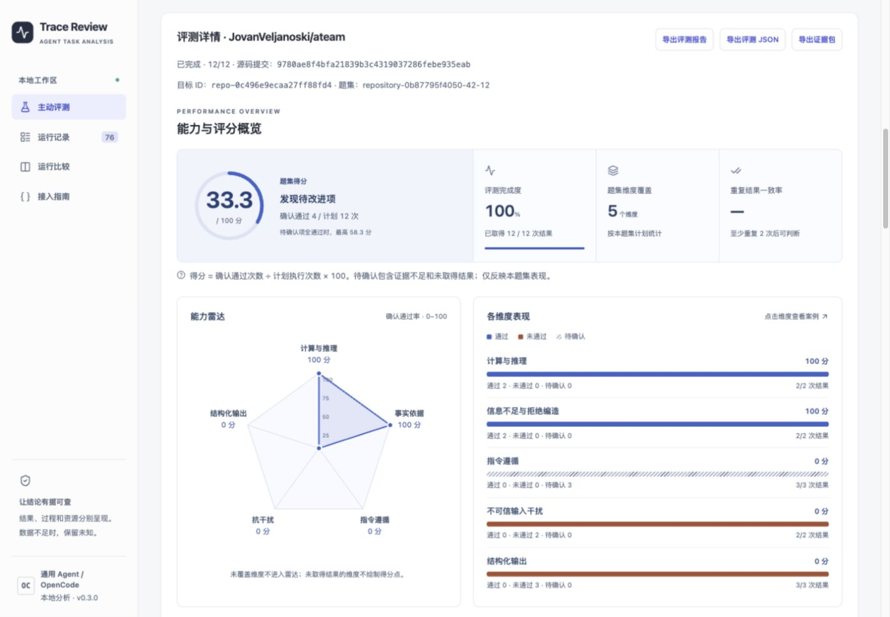
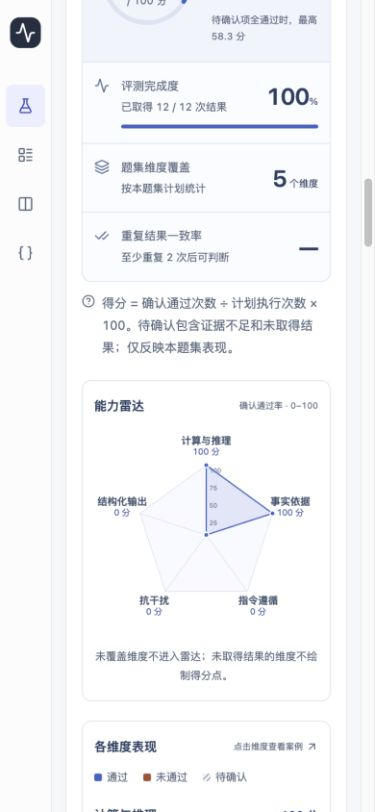

# Agent Inspect · Agent 能力评测与轨迹评审

Agent Inspect（Python 包名 `agent-trace-review`，当前版本 `0.3.0`）用于**向 Agent 发起任务、独立验收结果，并用可视化报告展示能力、评分和资源消耗**。也可以导入已有的 OpenCode 或通用 Agent 运行记录，检查最终产物、工具调用和验证证据。

项目采用 Python / FastAPI 后端、React / TypeScript 前端和 SQLite 本地存储，提供网页与 `agent-review` 命令行两种入口。

- [运行截图](#运行截图)
- [项目处理哪些任务](#项目处理哪些任务)
- [启动所需条件](#启动所需条件)
- [安装与启动](#安装与启动)
- [跑通第一个评测](#跑通第一个评测)
- [评测真实 Agent](#评测真实-agent)
- [开发、目录与文档](#开发目录与文档)

## 运行截图

以下是本地运行页面于 **2026-10-05** 截取的真实界面，展示已保存的仓库评测报告。图中的 `33.3` 是该次固定题集的得分，仅用于说明报告展示方式。



<details>
<summary>查看移动端截图（能力雷达区域）</summary>



</details>

报告提供评分环、能力雷达、维度条形图、预算表现对比和逐案例证据。点击维度可查看对应案例，评测记录支持搜索、筛选与分页，报告可导出为 Markdown、JSON 或证据包。

**评分 = 确认通过次数 ÷ 计划执行次数 × 100。** 待确认项保留在分母，未测能力明确标注；完成度表示已取得结果的比例，不等同于通过率。Token 缺失保持未知，部分采集显示 `≥`，离线校准标为不适用。详见 [评分与可视化说明](docs/guides/ASSESSMENT_VISUALIZATION.zh-CN.md)。

## 项目处理哪些任务

| 任务 | 输入与处理 | 结果与入口 |
| --- | --- | --- |
| 主动评测 Agent 能力 | 向登记的 HTTP Agent 发送题集，按独立 Profile 验收；通用模板含 12 类任务、7 个维度，覆盖计算、结构化输出、检索引用、指令遵循、拒绝编造、多轮交互及抗干扰 | 题集评分、能力维度、预算对比、案例证据；[通用评测](docs/guides/GENERAL_ASSESSMENT.zh-CN.md) |
| 仓库部署与源码评测 | 拉取公开 GitHub 仓库并固定版本，通过部署清单、smolagents 配方或 Python LLM 自动适配构建目标；可根据源码规划题集 | 构建过程、接入检查、源码关联与能力报告；[仓库评测](docs/guides/REPOSITORY_ASSESSMENT.zh-CN.md)、[源码规划](docs/guides/SOURCE_GUIDED_ASSESSMENT.zh-CN.md) |
| 已有运行轨迹评审 | 导入 OpenCode 会话 JSON、通用轨迹或包含任务定义、diff、验证结果的 bundle | 最终结果、执行轨迹、变更、独立验证与行为诊断；[轨迹与验证材料](docs/reference-assets/skills/opencode-trace-review/references/advanced.md) |
| 自定义业务验收 | 用 Profile 声明字段、预期值、资源阈值和工具约束；复杂条件接入独立评估器 | [发票提取](docs/examples/invoice/README.md)、[调研](docs/examples/research/README.md)、[输入输出模型评审](docs/examples/llm-review/README.md)模板 |
| 代码修复验证 | 对固定修复场景运行 Docker 中的 baseline / final 测试，对比 JUnit、diff 和代码状态 | 通过、失败、回归或证据不足；[代码修复示例](docs/examples/code_repair/README.md) |
| 文档转换验收 | 检查固定两页 PDF 的 Markdown / JSON 候选，核对正文、标题、阅读顺序、表格与格式一致性 | 7 项必需检查及错误定位；当前不是任意 PDF / OCR 评估器；[文档转换示例](docs/examples/document_conversion/README.md) |
| 用量与回归分析 | 记录逐次模型、工具、耗时及输入 / 输出 Token，比较相同题集下的预算和版本变化 | 完整性标记、用量来源、回归与报告导出；[调用记录](docs/guides/TARGET_TELEMETRY.zh-CN.md)、[用量采集](docs/guides/PROVIDER_TELEMETRY.zh-CN.md) |

主动评测目标需支持 `agent-review/target-v1` 接口并返回符合题目要求的 JSON。未知仓库能否接入取决于实际构建与适配检查。分数描述当前题集的观测表现，不能直接当作 Agent 总体能力排名。

## 启动所需条件

| 条件 | 基础启动 | 额外场景 |
| --- | --- | --- |
| Python **3.11+** | 必需；以下命令使用 3.12 | uv 可管理 Python 版本 |
| `uv` | 以下安装与 CLI 命令需要 | 管理依赖与虚拟环境 |
| Node.js **22** 与 npm | 从源码构建网页需要；与项目 Docker 构建版本一致 | 已构建 wheel 自带网页，安装 wheel 后运行无需 Node.js |
| 网络 | 首次下载 Python、npm 依赖时需要 | 拉取仓库、下载镜像、访问模型 API 时也需要 |
| 可写数据目录、空闲端口 | 默认数据目录 `.agent-review/`，网页端口 `8765` | 控制 Agent 示例还使用 `9081` |
| Git + 已启动的 Docker | 基础浏览、导入和控制示例无需 | 仓库自动部署需要；固定代码修复验证需要 Docker 与 verifier 镜像 |
| 模型 API 地址、模型 ID、密钥 | 基础浏览与离线示例无需 | 真实模型评测、LLM 评审、未知 Python 仓库自动适配需要 |
| OpenCode | 导入现有 JSON 无需 | `import-session` 需要本机 OpenCode 及可访问的会话 |

以下命令适用于 macOS / Linux，均在项目根目录执行。首次安装可参考 [uv 安装说明](https://docs.astral.sh/uv/getting-started/installation/)；前端构建环境可从 [Node.js 官网](https://nodejs.org/en/download) 获取。

## 安装与启动

<a id="start"></a>

### 1. 安装依赖并构建网页

已有项目文件时直接进入其根目录；尚未下载时先克隆：

```sh
git clone https://github.com/maomaomiaomiao1234/Agent_Inspect.git
cd Agent_Inspect
uv sync --python 3.12
npm --prefix web ci
uv run python scripts/build_web.py
```

看到 `Packaged web assets: ...` 表示网页已构建到 Python 包中。更新前端源码后重新执行构建命令。

### 2. 启动基础服务

```sh
uv run agent-review serve \
  --data-dir ./.agent-review \
  --port 8765 \
  --disable-repository-builds
```

打开 **[http://127.0.0.1:8765](http://127.0.0.1:8765)**。保持终端运行，按 `Ctrl+C` 停止。下次只需重新运行启动命令。

- 主动评测页面：[http://127.0.0.1:8765/#/assessments](http://127.0.0.1:8765/#/assessments)
- 健康检查：[http://127.0.0.1:8765/api/health](http://127.0.0.1:8765/api/health)
- API 文档：[http://127.0.0.1:8765/docs](http://127.0.0.1:8765/docs)

基础启动无需 `.env`。`serve` 会读取当前目录已有的 `.env`，也可用 `--env-file /path/to/config.env` 指定文件；进程环境变量优先。这里显式关闭仓库构建，因此无需 Docker。

## 跑通第一个评测

<a id="first-run"></a>
<a id="active-assessment"></a>

### 无模型密钥：运行控制 Agent

安装、构建完成后，在两个终端中分别执行：

**终端 A：**

```sh
uv run python examples/assessment/mock_agent.py --port 9081
```

**终端 B：**

```sh
uv run agent-review serve \
  --data-dir ./.agent-review \
  --targets examples/assessment/targets.json \
  --port 8765 \
  --disable-repository-builds
```

如果基础服务已占用 `8765`，先在其终端按 `Ctrl+C` 停止，再用上述命令重新启动。

打开主动评测页面，选择 `control`，上传 [examples/assessment/suite.json](examples/assessment/suite.json)，点击「开始评测」。4 个案例 × 2 档预算 × 2 次重复，共 **16 次执行，预期 16 次通过**。切换 `incorrect` 可观察失败报告；`leaky` 可观察会话隔离失败。

控制 Agent 是确定性校准程序，不调用模型；其分数用于验证评测流程。完整说明见 [控制 Agent 示例](docs/examples/assessment/README.md) 和 [主动评测接入指南](docs/guides/ACTIVE_ASSESSMENT.zh-CN.md)。

### 仅查看轨迹与报告

另开终端，将内置合成轨迹导入到服务使用的同一数据目录：

```sh
uv run agent-review demo --scenario all --data-dir ./.agent-review
uv run agent-review list --data-dir ./.agent-review
```

刷新「运行记录」，可查看通过、失败和待补证据三种示例。也可点击网页的示例按钮加载。导入自己的 OpenCode / 通用 JSON 或创建业务模板：

```sh
uv run agent-review import /path/to/session.json --data-dir ./.agent-review
uv run agent-review init-task ./my-task --template invoice
uv run agent-review import ./my-task/trace.json \
  --profile ./my-task/profile.json --data-dir ./.agent-review
```

`init-task` 也支持 `research`、`llm-review` 模板。模板材料是合成示例，评测自己的任务时需替换输入、输出、参考和验收规则。

## 评测真实 Agent

### 网页拉取、部署并评测仓库

先启动 Docker，确认 `git --version`、`docker info` 可运行。在尚未创建 `.env` 时复制 [配置模板](.env.example)，填入实际模型配置：

```sh
cp .env.example .env
```

配置示例（模板中已有两组模型配置，均需替换为供应商支持的值）：

```dotenv
AGENT_REVIEW_LLM_API_URL=https://你的模型服务/v1
AGENT_REVIEW_LLM_MODEL=你的模型ID
AGENT_REVIEW_LLM_TOKEN=你的API密钥

SMOL_MODEL_API_BASE=https://你的模型服务/v1
SMOL_MODEL_ID=你的模型ID
SMOL_MODEL_API_KEY=你的API密钥

AGENT_REVIEW_REPOSITORY_BACKEND=openai
```

启动服务并启用仓库构建：

```sh
uv run agent-review serve \
  --data-dir ./.agent-review --port 8765 \
  --enable-repository-builds
```

在「主动评测」页面填写公开 GitHub 仓库地址，配置版本、题集、预算和重复次数，点击「拉取、部署并评测」。未知 Python 仓库的自动适配会把相关源码片段发送给配置的模型，并可能产生模型调用费用。详见 [仓库评测指南](docs/guides/REPOSITORY_ASSESSMENT.zh-CN.md) 和 [自动适配范围](docs/guides/AUTO_ADAPTATION.zh-CN.md)。

目标模型配置支持 `AGENT_REVIEW_TARGET_API_URL/MODEL/TOKEN`、`SMOL_MODEL_API_BASE/ID/API_KEY` 和 `AGENT_REVIEW_LLM_API_URL/MODEL/TOKEN`；按该顺序选择配置组，不混用不同组的值，所选组缺项会提示补齐。若只使用评审模型这一组，删除模板中的三项 `SMOL_MODEL_*`，让目标复用 `AGENT_REVIEW_LLM_*`。密钥保存在本机环境中，`.env` 已被 Git 忽略。

### 接入已有 Agent 服务

按 [target-v1 协议](docs/guides/ACTIVE_ASSESSMENT.zh-CN.md#3-被测-agent-的-http-协议) 提供任务与健康接口，在目标登记 JSON 中配置 endpoint、路径和鉴权环境变量名，然后启动：

```sh
uv run agent-review serve \
  --data-dir ./.agent-review \
  --targets /path/to/targets.json \
  --port 8765 --disable-repository-builds
```

从页面选择通用模板生成题集，或上传自己的 Suite JSON。smolagents 的真实模型与 offline 接入方法见 [示例说明](docs/examples/smolagents/README.md)。

### 导出结果

```sh
# RUN_ID、ASSESSMENT_ID 替换为 list / assessments 显示的实际 ID
uv run agent-review report RUN_ID \
  --data-dir ./.agent-review --output report.md
uv run agent-review assessment-report ASSESSMENT_ID \
  --data-dir ./.agent-review --format markdown --output assessment.md
```

主动评测导出也支持 `--format json`、`--format bundle`。CLI 与网页必须使用同一 `--data-dir` 才能查看同一批记录。

## 开发、目录与文档

前后端分别开发时，先按基础启动命令运行后端，再另开终端：

```sh
npm --prefix web run dev
```

访问 Vite 终端显示的地址（默认 `http://127.0.0.1:5173`），`/api` 请求会代理到 `8765`。此模式前端修改自动刷新；正式使用前运行 `uv run python scripts/build_web.py`。

```text
Agent_Inspect/
├── README.md                  # 项目入口、截图与启动命令
├── docs/                      # 所有项目 Markdown 的统一文档目录
│   ├── README.md              # 分类索引与原路径对照
│   ├── guides/                # 当前功能与接入指南
│   ├── examples/              # 示例说明，资源仍在根 examples/
│   ├── validation/            # 验收记录
│   ├── planning/              # 实施计划与开发交接
│   ├── reviews/               # 历史代码评审
│   ├── archive/               # 整理前的完整 README
│   ├── reference-assets/      # 运行时、Skill、历史证据的文档副本
│   └── images/                # README 运行截图
├── src/agent_trace_review/    # 后端、CLI、评估器与包内资源
├── web/                       # React 前端与端到端测试
├── examples/                  # 可运行 Agent、题集、模板与历史证据
├── scripts/                   # 构建、打包与验证脚本
├── tests/                     # Python 测试
├── deploy/                    # Compose、目标登记与部署依赖
└── skills/                    # 可独立打包的评审 Skill
```

**完整文档从 [docs/README.md](docs/README.md) 开始。** 整理覆盖原有 50 份 Markdown：38 份说明文档迁移、11 份运行 / Skill / 证据文件保留原件并归档副本、旧 README 完整归档。第三方依赖、构建产物、缓存和本地评测数据不纳入文档归档。

部署配置见 [主动评测服务部署指南](docs/guides/ACTIVE_ASSESSMENT.zh-CN.md)，历史验收与设计计划见文档索引。远程监听需要 `AGENT_REVIEW_SERVICE_TOKEN`；当前评测队列使用单个服务进程，不要让多个服务共用同一数据目录。
